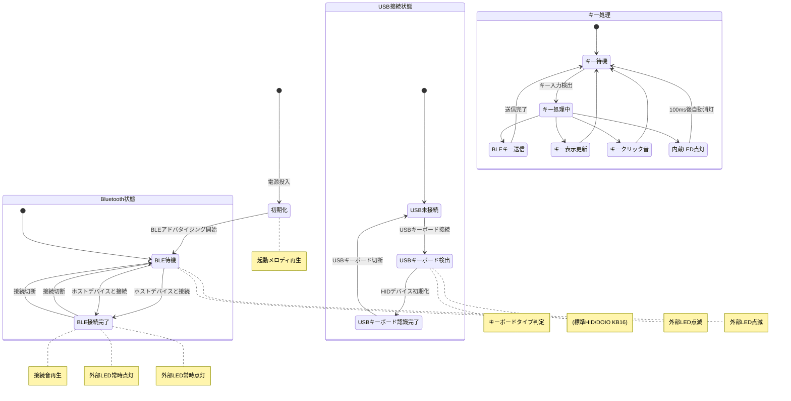
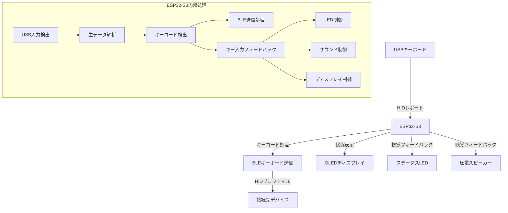
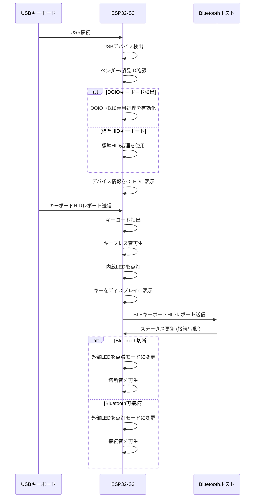
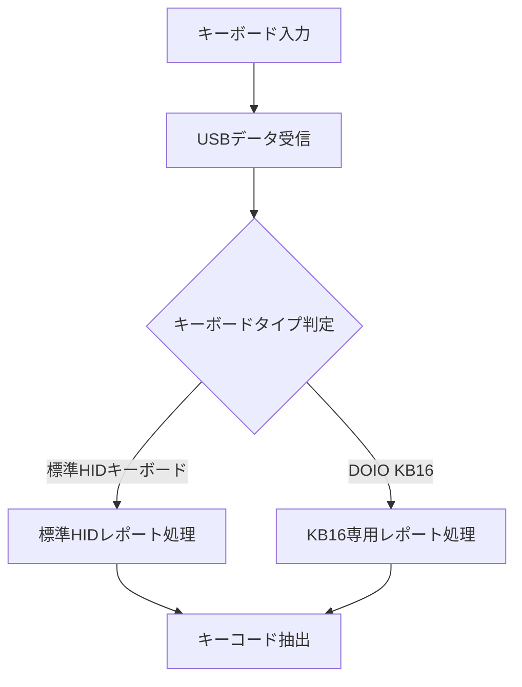
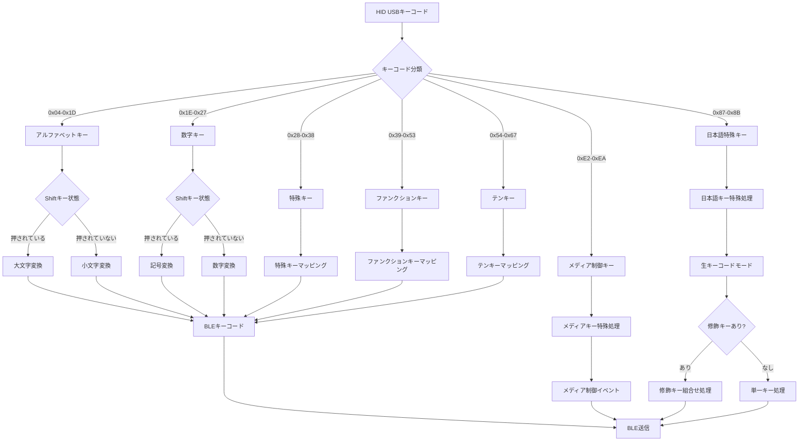
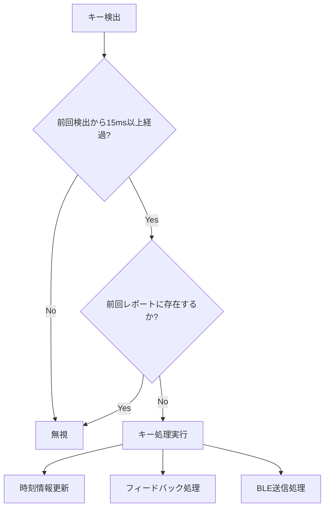
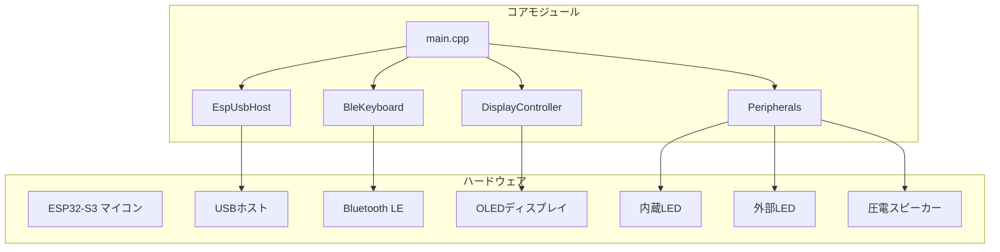
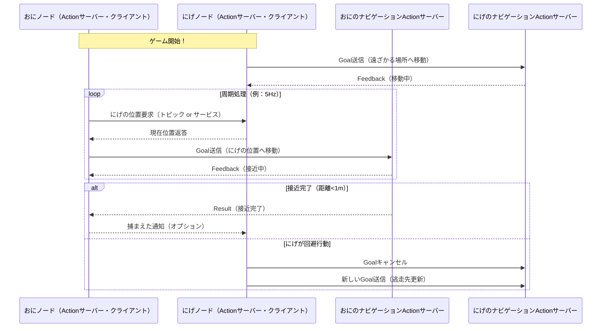

# USB-BLE キーボード変換アダプター

## 概要
このプロジェクトは、USB接続のキーボードをBluetooth接続に変換するアダプターです。ESP32-S3マイコンを使用して、USBキーボードからの入力を受け取り、Bluetooth Low Energy (BLE)経由で他のデバイスに送信します。

## 主な機能
- USB接続のキーボードをBluetoothキーボードとして使用可能
- OLED画面でデバイスのステータスと入力内容を表示
- LEDによるシステム状態表示（電源、Bluetooth接続状態）
- キー入力時のLED表示フィードバック
- 圧電スピーカーによる起動音、接続音、キークリック音
- 一般的なHIDキーボードとDOIO KB16キーボード専用サポート

## ハードウェア
- ESP32-S3マイコン (Seeed Studio XIAO ESP32S3)
- 128x64 OLED ディスプレイ (SSD1306, I2C接続)
- 赤色LED (電源/Bluetooth接続状態表示用)
- 圧電スピーカー (起動音/キークリック音用)

## ソフトウェア依存関係
- Arduino Framework
- Adafruit SSD1306 ライブラリ
- Adafruit GFX ライブラリ
- ESP32-BLE-Keyboard ライブラリ
- TinyUSB ライブラリ

## ファイル構造
- main.cpp - メインプログラム（キーボード入力処理、BLE送信、全体制御）
- DisplayController.h/.cpp - OLED表示管理クラス
- Peripherals.h/.cpp - LED制御とスピーカー制御クラス
- EspUsbHost.h/.cpp - USB HID処理クラス

## 使用方法
1. USBキーボードを本機器に接続
2. 電源を入れると自動的にBLEアドバタイジングを開始、起動メロディが再生されます
3. 接続したいデバイス(PC、スマートフォンなど)でBluetooth設定から「DOIO Keyboard」を選択
4. 接続が確立すると接続音が鳴り、状態LEDが点灯状態になります
5. OLEDディスプレイに接続状態が表示され、入力されたキーが表示されます
6. キーボードを通常通り使用可能になります

## LED・スピーカー動作
- **内蔵LED (GPIO 21)**: キー入力時に一時的に点灯
- **外部LED (GPIO 2)**:
  - 電源投入時：点灯
  - Bluetooth接続時：常時点灯
  - Bluetooth未接続時：点滅
- **圧電スピーカー (GPIO 1)**:
  - 起動時：起動メロディ（C-E-G-Cの上昇音階）
  - キー入力時：短いクリック音
  - Bluetooth接続時：接続音（上昇音）
  - Bluetooth切断時：切断音（下降音）

## システム状態遷移図



## データフロー図



## USBキーボード検出プロセス



## キーコード抽出プロセス

キー入力時のデータフローと処理手順を詳細に説明します。

### 1. USB HIDレポート取得


### 2. データ構造と抽出方法

#### 標準HIDキーボードのデータ構造
```
バイト0: 修飾キー (Modifier)
  - bit 0: 左Ctrl
  - bit 1: 左Shift
  - bit 2: 左Alt
  - bit 3: 左GUI (Windows/Command)
  - bit 4: 右Ctrl
  - bit 5: 右Shift
  - bit 6: 右Alt
  - bit 7: 右GUI

バイト1: 予約済み (通常は0)

バイト2-7: プレスされたキーのコード (最大6キー)
  - 0x00: キー無し
  - 0x04-0x1D: 'a'-'z'キー
  - 0x1E-0x27: '1'-'0'キー
  - 0x28-0x38: Enter, Esc, Backspace等の特殊キー
  - 0x39-0x53: F1-F12, Caps Lockなどの機能キー
```

#### DOIO KB16専用処理
DOIO KB16は特殊なデータフォーマットを使用するため、以下の追加処理を行います:

1. 不要な修飾キー情報を除外 (常に0x06を送信する特性に対応)
2. バイトスキャンによる有効なキーコード検出
3. バイト位置に基づく修飾キー情報の復元:
   - バイト1-4の特定値から修飾キー状態を検出


### 3. キーコードマッピング

USBのHIDキーコードをBLEキーコード/ASCIIに変換する処理:



### 4. 重複キー検出防止

実際のキーボードでは機械的な特性により、キーを押した瞬間に複数回の入力信号が発生することがあります。これを防ぐため、以下の処理を行います:

1. 同一キーコードの時間間隔チェック (15ms以内の再入力は無視)
2. 前回のキーボードレポートとの比較による新規キーのみの処理
3. キーコードバッファ (6キー分) 内の重複チェック



### 5. BLEキーボード送信

```mermaid
flowchart TD
    KeyCode[キーコード] --> BLEConnCheck{BLE接続中?}
    BLEConnCheck -->|No| Skip[送信スキップ]
    BLEConnCheck -->|Yes| KeyTypeCheck{キータイプ判定}
    
    KeyTypeCheck -->|通常キー| Normal[単一キー送信]
    KeyTypeCheck -->|特殊キー| Special[特殊キー処理]
    KeyTypeCheck -->|修飾キー組合せ| Combo[組合せキー処理]
    KeyTypeCheck -->|メディアキー| Media[メディアキー送信]
    
    Normal --> Write[BLEキーボードwrite()]
    Special --> PressRelease[press()→release()]
    Combo --> MultiPress[複数press()→releaseAll()]
    Media --> MediaWrite[メディアキーwrite()]
    
    Write --> Done[送信完了]
    PressRelease --> Done
    MultiPress --> Done
    MediaWrite --> Done
```

### 6. パフォーマンス最適化

キーコード抽出と処理においては、以下の最適化を実施しています：

1. **必要最小限のメモリ使用**：NimBLEモードを使用し、RAMとFlashメモリ使用量を大幅に削減
   - 標準BLEモード: RAM 30.5KB / Flash 994KB
   - NimBLEモード: RAM 27.2KB / Flash 579KB (Flash容量44%削減)

2. **キー処理の高速化**：
   - キー遅延を8msから15msに調整（連打性能と誤入力防止のバランス）
   - BLEキー送信のバッファリング処理
   - 不要なデバッグ出力の条件付きコンパイル

3. **専用キーボード最適化**：
   - DOIO KB16の特殊なレポート構造に対応した専用処理パス
   - ベンダー/製品ID自動検出による適切な処理の選択

## 注意事項

### ファームウェア書き込み
ESP32-S3がUSBホストモードになると、通常のシリアル通信ができなくなります。ファームウェアを書き込む際は以下の手順に従ってください。

1. Keyboardに接続されてるUSBケーブルを抜く
2. BOOTボタン（またはIO0ボタン）を押しながらUSBケーブルを接続
3. BOOTボタンを数秒間押し続ける
4. ファームウェアを書き込む

### 対応キーボード
- 標準的なHIDキーボード
- DOIO KB16キーボード（専用サポート）
- その他多くのUSB HIDキーボード

## GPIO設定
| 機能 | GPIO番号 | 備考 |
|------|----------|------|
| 内蔵LED | 21 | キー入力表示用 |
| 拡張LED（赤） | 2 | 電源/Bluetooth状態表示用 |
| 圧電スピーカー | 1 | キークリック音・起動音 |
| OLED SDA | I2C標準 | ディスプレイデータライン |
| OLED SCL | I2C標準 | ディスプレイクロックライン |

## カスタマイズ可能なパラメータ
- Peripherals.h:
  - BLE_BLINK_INTERVAL: LED点滅間隔(ms)
  - KEY_FREQ: キープレス音の周波数(Hz)
  - KEY_DURATION: キープレス音の長さ(ms)
  - SOUND_ENABLED: サウンド機能のオン/オフ

- DisplayController.h:
  - SCREEN_WIDTH/HEIGHT: ディスプレイサイズ
  - maxChars: 表示文字列バッファサイズ

- main.cpp:
  - bleKeyboard("DOIO Keyboard", "DOIO", 100): デバイス名、製造者名、バッテリー%

## トラブルシューティング
- キーボードが認識されない場合:
  - USB接続を確認してください
  - サポートされていないキーボードの可能性があります
  
- Bluetoothが接続できない場合:
  - 接続先デバイスのBluetooth設定を確認してください
  - 一度ペアリングを削除して、再度接続を試みてください
  
- プログラムが書き込めない場合:
  - USB関連設定をコメントアウトしてください
  - ブートモード操作を正確に行ってください

- キーが誤認識される場合:
  - キーボードの種類に応じた特殊処理が必要な可能性があります
  - キーコードのデバッグ出力を有効にして確認してください

## システムアーキテクチャ



## ライセンス
MIT License

## 最終更新日
2025年5月8日

