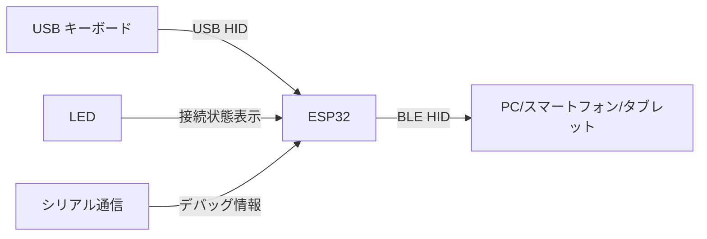
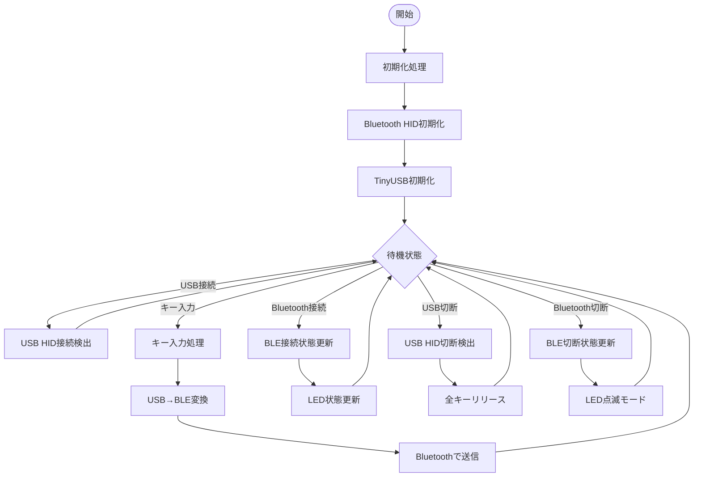
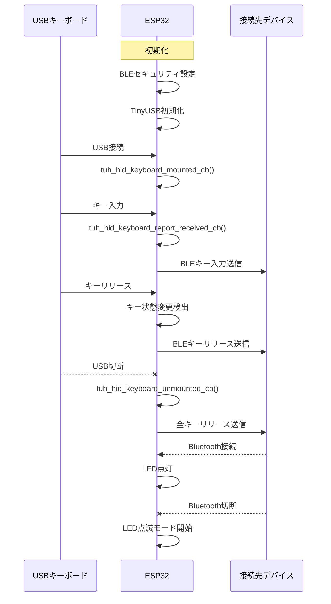
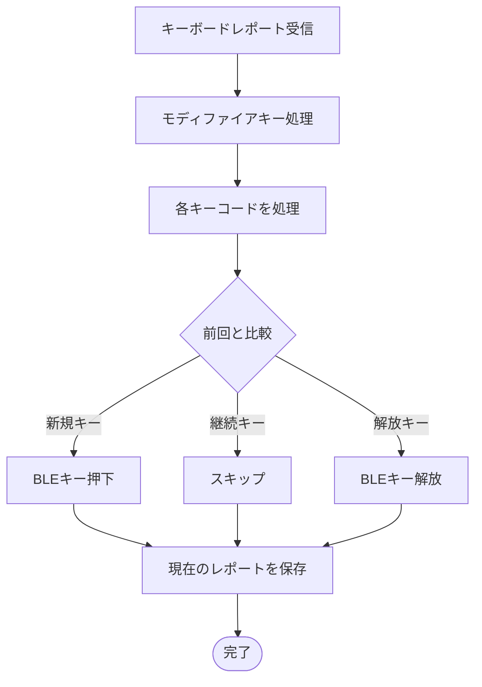
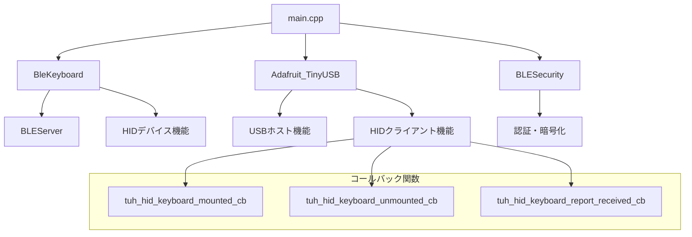

# DOIO Bluetooth HIDブリッジ

このプロジェクトは、USB接続されたキーボードの入力をBluetooth HID経由で他のデバイスに転送するブリッジ機能を提供します。ESP32（Seeed XIAO ESP32S3）を使用して、USBキーボードをBluetooth対応デバイス（PC、スマートフォン、タブレットなど）で使用できるようにします。

## 主な機能

- USB HIDキーボードからの入力をBluetooth HIDに変換
- 最大6キー同時押しのNキーロールオーバー対応
- モディファイアキー（Ctrl、Shift、Alt、GUI/Windowsキー）の完全サポート
- セキュアなBluetooth接続（ペアリングと暗号化）
- 接続状態をLEDで表示
- シリアルモニタによるデバッグ情報出力

## システム概要図

## 処理フロー

## シーケンス図

## キー処理ロジック

## 使用方法

1. ESP32（Seeed XIAO ESP32S3）にこのファームウェアを書き込みます
2. USBキーボードをESP32のUSBポートに接続します
3. Bluetooth対応デバイスでペアリング設定を開き、"DOIO_KB16"という名前のデバイスを選択します
4. ペアリングが完了すると、USBキーボードからの入力がBluetooth経由でデバイスに送信されます
5. 接続状態はLEDで確認できます：
   - 点灯：Bluetooth接続中
   - ゆっくり点滅：ペアリング待機中

## ハードウェア要件

- Seeed XIAO ESP32S3（または互換性のあるESP32マイコン）
- USB HIDキーボード
- USB OTGケーブル（必要に応じて）

## ソフトウェア構成

## セキュリティ

このプロジェクトでは、Bluetooth接続のセキュリティを確保するために以下の機能を実装しています：

- MITM（Man-In-The-Middle）プロテクション
- ボンディング（ペアリング情報の永続化）
- 16ビット暗号化キー
- カスタマイズ可能なパスキー認証

## トラブルシューティング

- ペアリングに失敗する場合：デバイスのBluetooth設定からDOIO_KB16を削除して再試行してください
- キー入力が反応しない場合：接続状態を確認し、必要に応じてUSBキーボードの再接続やESP32のリセットを行ってください
- 特殊キーが動作しない場合：シリアルモニタでキーコードを確認し、必要に応じてコードを修正してください

## ライセンス

このプロジェクトはオープンソースとして提供されています。使用するライブラリのライセンスに従ってください。

## 貢献

バグ報告や機能強化の提案は大歓迎です。プルリクエストを送るか、イシューを作成してください。