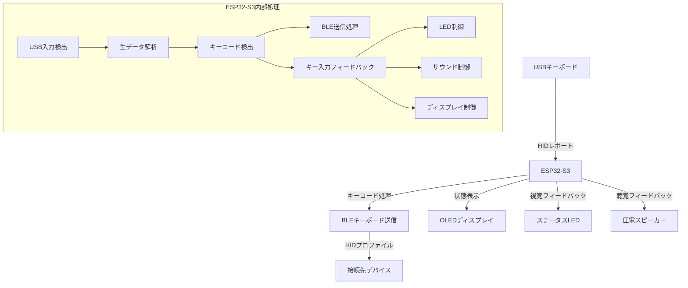
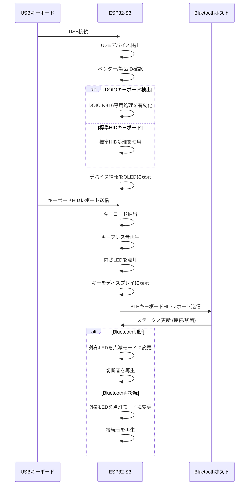
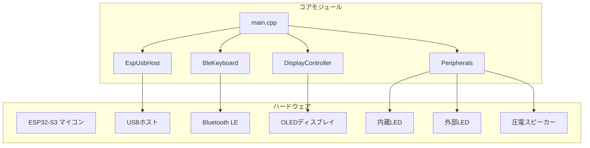

# USB-BLE キーボード変換アダプター

## 概要
このプロジェクトは、USB接続のキーボードをBluetooth接続に変換するアダプターです。ESP32-S3マイコンを使用して、USBキーボードからの入力を受け取り、Bluetooth Low Energy (BLE)経由で他のデバイスに送信します。

## 主な機能
- USB接続のキーボードをBluetoothキーボードとして使用可能
- OLED画面でデバイスのステータスと入力内容を表示
- LEDによるシステム状態表示（電源、Bluetooth接続状態）
- キー入力時のLED表示フィードバック
- 圧電スピーカーによる起動音、接続音、キークリック音
- 一般的なHIDキーボードとDOIO KB16キーボード専用サポート

## ハードウェア
- ESP32-S3マイコン (Seeed Studio XIAO ESP32S3)
- 128x64 OLED ディスプレイ (SSD1306, I2C接続)
- 赤色LED (電源/Bluetooth接続状態表示用)
- 圧電スピーカー (起動音/キークリック音用)

## ソフトウェア依存関係
- Arduino Framework
- Adafruit SSD1306 ライブラリ
- Adafruit GFX ライブラリ
- ESP32-BLE-Keyboard ライブラリ
- TinyUSB ライブラリ

## ファイル構造
- main.cpp - メインプログラム（キーボード入力処理、BLE送信、全体制御）
- DisplayController.h/.cpp - OLED表示管理クラス
- Peripherals.h/.cpp - LED制御とスピーカー制御クラス
- EspUsbHost.h/.cpp - USB HID処理クラス

## 使用方法
1. USBキーボードを本機器に接続
2. 電源を入れると自動的にBLEアドバタイジングを開始、起動メロディが再生されます
3. 接続したいデバイス(PC、スマートフォンなど)でBluetooth設定から「DOIO Keyboard」を選択
4. 接続が確立すると接続音が鳴り、状態LEDが点灯状態になります
5. OLEDディスプレイに接続状態が表示され、入力されたキーが表示されます
6. キーボードを通常通り使用可能になります

## LED・スピーカー動作
- **内蔵LED (GPIO 21)**: キー入力時に一時的に点灯
- **外部LED (GPIO 2)**:
  - 電源投入時：点灯
  - Bluetooth接続時：常時点灯
  - Bluetooth未接続時：点滅
- **圧電スピーカー (GPIO 1)**:
  - 起動時：起動メロディ（C-E-G-Cの上昇音階）
  - キー入力時：短いクリック音
  - Bluetooth接続時：接続音（上昇音）
  - Bluetooth切断時：切断音（下降音）

## システム状態遷移図


## データフロー図



## USBキーボード検出プロセス



## 注意事項

### ファームウェア書き込み
ESP32-S3がUSBホストモードになると、通常のシリアル通信ができなくなります。ファームウェアを書き込む際は以下の手順に従ってください。

1. platformio.iniのUSB関連設定をコメントアウト:
```ini
build_flags =
    ; -D ARDUINO_USB_MODE=1
    ; -D CONFIG_USB_ENABLED=1
    ; -D CONFIG_TINYUSB_ENABLED=1
    ; -D CONFIG_TINYUSB_HID_ENABLED=1
```

2. ファームウェアを書き込む
3. 書き込み後、上記の設定のコメントを外して再ビルド

または、ESP32-S3をブートモードに入れる方法：
1. USBケーブルを抜く
2. BOOTボタン（またはIO0ボタン）を押しながらUSBケーブルを接続
3. BOOTボタンを数秒間押し続ける
4. ファームウェアを書き込む

### 対応キーボード
- 標準的なHIDキーボード
- DOIO KB16キーボード（専用サポート）
- その他多くのUSB HIDキーボード

## GPIO設定
| 機能 | GPIO番号 | 備考 |
|------|----------|------|
| 内蔵LED | 21 | キー入力表示用 |
| 拡張LED（赤） | 2 | 電源/Bluetooth状態表示用 |
| 圧電スピーカー | 1 | キークリック音・起動音 |
| OLED SDA | I2C標準 | ディスプレイデータライン |
| OLED SCL | I2C標準 | ディスプレイクロックライン |

## カスタマイズ可能なパラメータ
- Peripherals.h:
  - BLE_BLINK_INTERVAL: LED点滅間隔(ms)
  - KEY_FREQ: キープレス音の周波数(Hz)
  - KEY_DURATION: キープレス音の長さ(ms)
  - SOUND_ENABLED: サウンド機能のオン/オフ

- DisplayController.h:
  - SCREEN_WIDTH/HEIGHT: ディスプレイサイズ
  - maxChars: 表示文字列バッファサイズ

- main.cpp:
  - bleKeyboard("DOIO Keyboard", "DOIO", 100): デバイス名、製造者名、バッテリー%

## トラブルシューティング
- キーボードが認識されない場合:
  - USB接続を確認してください
  - サポートされていないキーボードの可能性があります
  
- Bluetoothが接続できない場合:
  - 接続先デバイスのBluetooth設定を確認してください
  - 一度ペアリングを削除して、再度接続を試みてください
  
- プログラムが書き込めない場合:
  - USB関連設定をコメントアウトしてください
  - ブートモード操作を正確に行ってください

- キーが誤認識される場合:
  - キーボードの種類に応じた特殊処理が必要な可能性があります
  - キーコードのデバッグ出力を有効にして確認してください

## システムアーキテクチャ



## ライセンス
MIT License

## 最終更新日
2025年5月6日