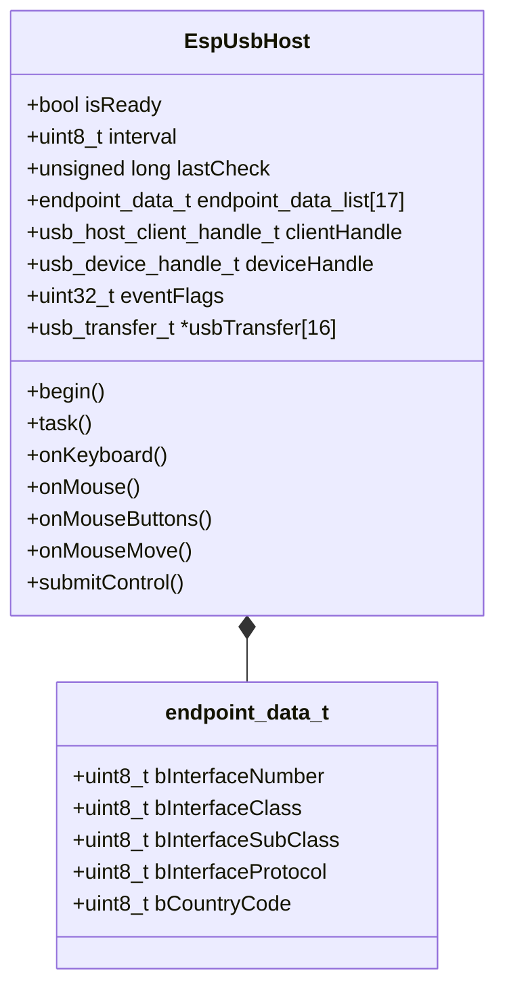
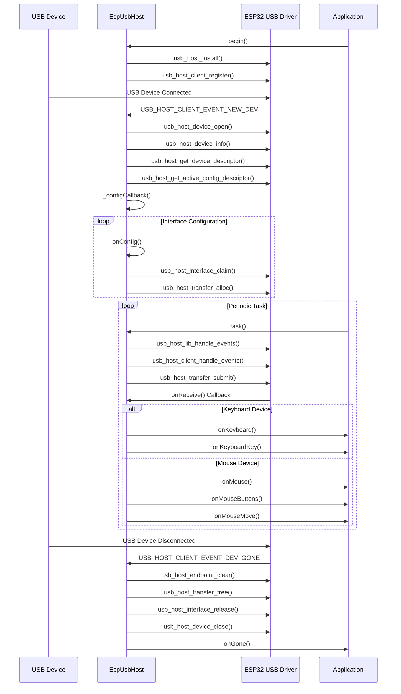

# ESP32 USB Host 仕様書

## 概要

EspUsbHostクラスはESP32マイコンのUSBホスト機能を利用して、キーボードやマウスなどのUSB HIDデバイスを接続・制御するためのライブラリです。このライブラリは、ESP-IDF(Espressif IoT Development Framework)のUSBホストAPIをArduino環境で使いやすく抽象化しています。

## アーキテクチャ

### クラス構成図



### イベント処理フロー



## 主要コンポーネントと機能

### 1. 初期化とセットアップ

```cpp
void EspUsbHost::begin(void)
```

USBホスト機能を初期化し、イベント処理の準備を行います。以下のステップで初期化されます：

1. USB Host Controllerの初期化 (`usb_host_install`)
2. USBクライアントの登録 (`usb_host_client_register`)

### 2. デバイス検出と設定

USBデバイスが接続されると、以下のイベント処理が行われます：

1. `USB_HOST_CLIENT_EVENT_NEW_DEV` イベントの検出
2. デバイスのオープン (`usb_host_device_open`)
3. デバイス情報の取得 (`usb_host_device_info`)
4. デバイス記述子の取得 (`usb_host_get_device_descriptor`)
5. 設定記述子の取得 (`usb_host_get_active_config_descriptor`)
6. インターフェースの設定とクレーム (`usb_host_interface_claim`)

### 3. データ転送処理

```cpp
void EspUsbHost::task(void)
```

定期的に呼び出されるタスク関数で、以下の処理を行います：

1. USBホストライブラリのイベント処理 (`usb_host_lib_handle_events`)
2. クライアントイベント処理 (`usb_host_client_handle_events`)
3. 割り込み転送の実行 (`usb_host_transfer_submit`)

### 4. HIDデバイス対応

#### キーボード処理

```cpp
void onKeyboard(hid_keyboard_report_t report, hid_keyboard_report_t last_report)
void onKeyboardKey(uint8_t ascii, uint8_t keycode, uint8_t modifier)
```

キーボードからの入力を処理し、キーが押された/離されたイベントを検出します。

#### マウス処理

```cpp
void onMouse(hid_mouse_report_t report, uint8_t last_buttons)
void onMouseButtons(hid_mouse_report_t report, uint8_t last_buttons)
void onMouseMove(hid_mouse_report_t report)
```

マウスの動き、ボタンクリック、ホイール操作などのイベントを処理します。

## USB Host技術詳細

### ESP32のUSBホスト機能

ESP32-S3などのESP32シリーズの一部は、USBホスト機能を内蔵しており、これを使用することでESP32からUSBデバイスを制御できます。ESP32のUSBホスト機能は以下の特徴を持っています：

- ESP-IDFのUSBホストAPIを使用
- フルスピード（12Mbps）およびロースピード（1.5Mbps）のUSBデバイスをサポート
- 最大16エンドポイントの管理
- HID（Human Interface Device）クラスの実装

### USB通信プロトコル

EspUsbHostクラスは、USBプロトコルの各層を以下のように抽象化しています：

1. **物理層・トランスポート層**: ESP32のUSBコントローラが担当
2. **デバイス層**: 
   - デバイス検出 (`USB_HOST_CLIENT_EVENT_NEW_DEV`)
   - デバイス情報取得 (`usb_host_device_info`)
   - デスクリプタ解析 (`onConfig`)
3. **クラス層**:
   - HIDクラス処理 
   - レポートディスクリプタの解析 (`_onReceiveControl`)
   - キーボード/マウスプロトコルの実装

### メモリ管理

USBデータ転送のためのバッファは動的に確保され、以下のように管理されます：

- 転送バッファの確保: `usb_host_transfer_alloc`
- エンドポイントのクリア: `usb_host_endpoint_clear` 
- 転送バッファの解放: `usb_host_transfer_free`

### デバッグ機能

このライブラリには、USBパケットを分析するためのデバッグ機能が含まれています：

```cpp
void _printPcapText(const char* title, uint16_t function, uint8_t direction, uint8_t endpoint, uint8_t type, uint8_t size, uint8_t stage, const uint8_t *data)
```

この関数は、USBパケットをWiresharkのPCAPフォーマットに類似した形式でログ出力し、デバッグに役立ちます。

## 使用例

```cpp
#include "EspUsbHost.h"

// EspUsbHostクラスを継承してカスタム処理を実装
class MyUsbHost : public EspUsbHost {
public:
  // キーボードイベントの処理
  void onKeyboardKey(uint8_t ascii, uint8_t keycode, uint8_t modifier) override {
    Serial.printf("Key: %c (0x%02x), Modifier: 0x%02x\n", ascii, keycode, modifier);
  }
  
  // マウス移動イベントの処理
  void onMouseMove(hid_mouse_report_t report) override {
    Serial.printf("Mouse move: X=%d, Y=%d, Wheel=%d\n", report.x, report.y, report.wheel);
  }
};

MyUsbHost usbHost;

void setup() {
  Serial.begin(115200);
  usbHost.begin();
}

void loop() {
  // USBホストタスクを定期的に実行
  usbHost.task();
  delay(1);
}
```

## 制限事項

- ESP32のすべてのバリアントがUSBホスト機能をサポートしているわけではありません。ESP32-S3のようにUSBホスト機能をサポートするチップが必要です。
- 一部のUSBデバイスは高速（480Mbps）モードでのみ動作するため、このライブラリでは動作しない場合があります。
- 消費電力の大きいUSBデバイスは、別途電源供給が必要になる場合があります。
- 複雑なUSBデバイス（複合デバイスなど）の完全なサポートには制限がある場合があります。